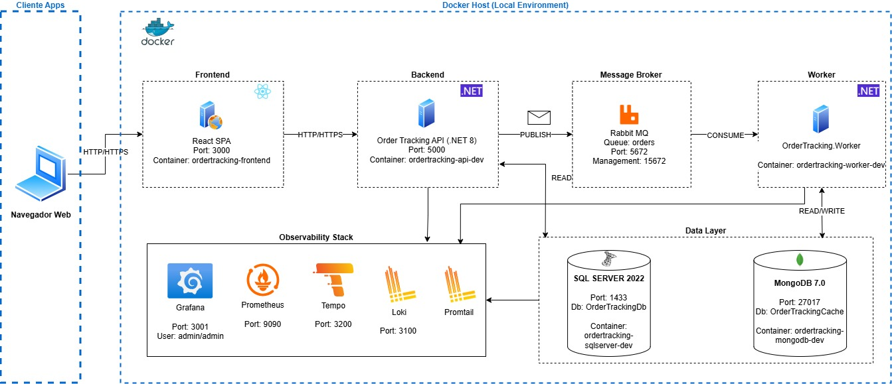
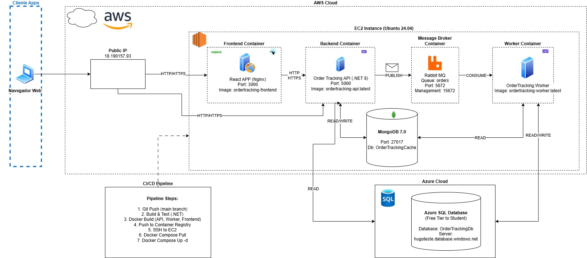

# Order Tracking System - Sistema de Rastreamento de Pedidos

Este projeto foi desenvolvido como solução para o teste prático de Desenvolvedor .NET. O sistema permite o cadastro e rastreamento de pedidos, utilizando processamento assíncrono via mensageria, persistência em banco relacional e cache NoSQL.

[](https://dotnet.microsoft.com/)
[](https://reactjs.org/)
[](https://www.docker.com/)

## Tecnologias Utilizadas

### Backend
- **.NET 8** - Framework principal
- **ASP.NET Core Web API** - REST API
- **Entity Framework Core** - ORM para SQL Server
- **FluentValidation** - Validação de dados
- **Serilog** - Logging estruturado

### Mensageria
- **RabbitMQ 3** - Message broker para processamento assíncrono

### Bancos de Dados
- **SQL Server 2022** - Banco relacional (source of truth)
- **Azure SQL Database** - Produção (Free Tier para estudantes)
- **MongoDB 7.0** - Cache e consultas rápidas

### Frontend
- **React 18** - Framework UI
- **TypeScript** - Type safety
- **Vite** - Build tool moderno
- **Axios** - Cliente HTTP

### Observabilidade
- **Prometheus** - Coleta de métricas
- **Grafana** - Dashboards e visualização
- **Loki** - Agregação de logs
- **Promtail** - Shipper de logs
- **Tempo** - Distributed tracing
- **OpenTelemetry** - Instrumentação

### DevOps
- **Docker** + **Docker Compose** - Containerização
- **GitHub Actions** / **Azure DevOps** - CI/CD
- **AWS EC2** - Hospedagem (Ubuntu 24.04)

### Testes
- **xUnit** - Framework de testes
- **Moq** - Mocking
- **FluentAssertions** - Asserções fluentes
- **Testcontainers** - Testes de integração

## Pré-requisitos

### Para Rodar Localmente

- [Docker Desktop](https://www.docker.com/products/docker-desktop) 20.10+
- [Docker Compose](https://docs.docker.com/compose/) v2.0+
- **8GB RAM** (mínimo) - Recomendado 16GB
- **10GB** de espaço em disco

### Opcional (para desenvolvimento)
- [.NET 8 SDK](https://dotnet.microsoft.com/download)
- [Node.js 18+](https://nodejs.org/)

## Como Executar

### 1. Clone o Repositório

```bash
git clone --recurse-submodules https://github.com/pimentahugo/teste-pratico

# Acessar diretorio do projeto
cd teste-pratico
```

### 2. Inicie Todos os Serviços

```bash
# Iniciar todos os containers
docker-compose up -d --build

# Acompanhar os logs
docker-compose logs -f

# Verificar status
docker-compose ps
```

### 4. Aguarde a Inicialização

Os serviços levam cerca de **2-3 minutos** para iniciar completamente. O Docker Compose possui health checks que garantem a ordem correta de inicialização:

1. SQL Server (aguarda estar pronto)
2. MongoDB (aguarda estar pronto)  
3. RabbitMQ (aguarda estar pronto)
4. API (aguarda dependências)
5. Worker (aguarda dependências)
6. Frontend (aguarda API)

### 5. Acesse as Aplicações

| Serviço | URL | Credenciais |
|---------|-----|-------------|
| **Frontend** | http://localhost:3000 | - |
| **API** | http://localhost:5000 | - |
| **Swagger** | http://localhost:5000/swagger | - |
| **Health Check** | http://localhost:5000/health | - |
| **Grafana** | http://localhost:3001 | admin / admin |
| **Prometheus** | http://localhost:9090 | - |
| **RabbitMQ** | http://localhost:15672 | guest / guest |

### 6 Endpoints Disponíveis 

## Endpoints 

### POST /orders 
- Cadastra um novo pedido
- Processamento assíncrono via fila

### GET /orders/{id} 
- Consulta pedido no SQL Server (com cache em MongoDB)

### GET /orders/ 
- Consulta todos os pedidos no banco de dados SQL

## Observabilidade
No ambiente local, foi implementada uma stack de observabilidade composta por: 

- Prometheus
- Grafana
- Loki
- Promtail

Em produção, essa stack não foi aplicada devido às limitações de recursos da EC2 Free Tier.

### Grafana Dashboards

Acesse http://localhost:3001 (admin/admin) para visualizar:

- **Order Processing Dashboard**
  - Taxa de requisições por minuto
  - Tempo médio de processamento
  - Tamanho da fila RabbitMQ
  - Taxa de sucesso/erro

- **System Metrics**
  - CPU e Memória dos containers
  - Throughput da API
  - Latência (p50, p95, p99)

- **Logs em Tempo Real**
  - Logs estruturados de API
  - Filtros por nível (Error, Warning, Info)

## Testes

### Executar Todos os Testes

```bash
# Rodar todos os testes
dotnet test

# Com cobertura de código
dotnet test /p:CollectCoverage=true

# Testes unitários apenas
dotnet test tests/OrderTracking.UnitTests

# Testes de integração
dotnet test tests/OrderTracking.IntegrationTests

# Verbose
dotnet test --logger "console;verbosity=detailed"
```

### Tipos de Teste

- **Unitários** : Lógica de domínio, validators, casos de uso
- **Integração**: API endpoints, repositórios, RabbitMQ

## Arquitetura 

### Ambiente Local (Docker Compose) 
 

### Ambiente Produção (AWS EC2 + Azure SQL) 


## Fluxo de Processamento

1. **Cliente/Frontend** envia requisição POST para criar pedido
2. **API** valida os dados usando FluentValidation
3. **API** publica mensagem na fila RabbitMQ
6. **API** retorna 202 Accepted
7. **Worker** consome mensagem da fila (assíncrono)
8. **Worker** processa a lógica de negócio
9. **Worker** salva o pedido no SQL Server
10. **Worker** atualiza o cache MongoDB
11. **Observabilidade** captura logs, métricas e traces de todo o fluxo

## Ambiente de Produção

### Demonstração Online

O sistema está disponível para testes em:

- **Frontend**: http://18.190.157.93/
- **API**: http://18.190.157.93/api
- **Swagger**: http://18.190.157.93/swagger

>  **Nota**: Este é um ambiente de demonstração para avaliação do teste prático.

### Arquitetura de Produção

**Infraestrutura:**
- AWS EC2 (t3.medium - Ubuntu 24.04)
- Containers Docker (API, Worker, RabbitMQ, MongoDB, Frontend)
- Azure SQL Database (Free Tier para Estudantes)
- Security Group configurado com regras de firewall

**CI/CD:**
- Pipeline automatizado (GitHub Actions / Azure DevOps)
- Build, Test, Docker Build/Push
- Deploy automático via SSH para EC2
- Health checks pós-deploy

**Segurança:**
- Conexão com Azure SQL via TLS/Encrypted
- Security Group limitando portas expostas
- Secrets gerenciados via variáveis de ambiente
- Firewall do Azure SQL permitindo apenas IP da EC2

## Estrutura do Projeto

```
order-tracking-system/
├── src/
│   ├── OrderTracking.API/              # Web API (.NET 8)
│   ├── OrderTracking.Application/      # Casos de uso, Validators
│   ├── OrderTracking.Domain/           # Entidades e regras de negócio
│   ├── OrderTracking.Infrastructure/   # Repositórios, EF Core, RabbitMQ
│   └── OrderTracking.Worker/           # Background worker
├── tests/
│   ├── OrderTracking.UnitTests/
│   ├── OrderTracking.IntegrationTests/
│   └── OrderTracking.ValidationTests/
├── frontend/                           # React + TypeScript (submodule para repositório do frontend)
├── docker/
│   └── observability/                  # Configs Prometheus, Grafana, Loki
├── docs/
│   ├── arquitetura-local.drawio
│   └── arquitetura-producao.drawio
├── docker-compose.yml
├── docker-compose.prod.yml
└── README.md
```

## Conceitos Implementados

### Arquitetura e Design
- Clean Architecture
- Domain-Driven Design (DDD)
- Repository Pattern
- Unit of Work Pattern
- Dependency Injection

### Boas Práticas
- SOLID Principles
- Async/Await
- Logging estruturado (Serilog)
- Health Checks
- Validação com FluentValidation
- Tratamento de erros global
- Cache Strategy (Cache-Aside)

### DevOps e Observabilidade
- Containerização com Docker
- Orquestração com Docker Compose
- CI/CD Pipeline
- Métricas com Prometheus
-  Dashboards com Grafana
- Log aggregation com Loki

## Comandos Úteis

### Docker Compose

```bash
# Parar todos os serviços
docker-compose down

# Parar e remover volumes (limpar dados)
docker-compose down -v

# Rebuild e restart
docker-compose up -d --build

# Ver logs de um serviço específico
docker-compose logs -f api
docker-compose logs -f worker

# Reiniciar um serviço
docker-compose restart api

# Ver status e saúde
docker-compose ps
```
